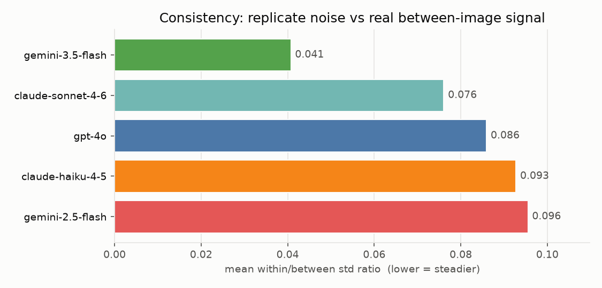
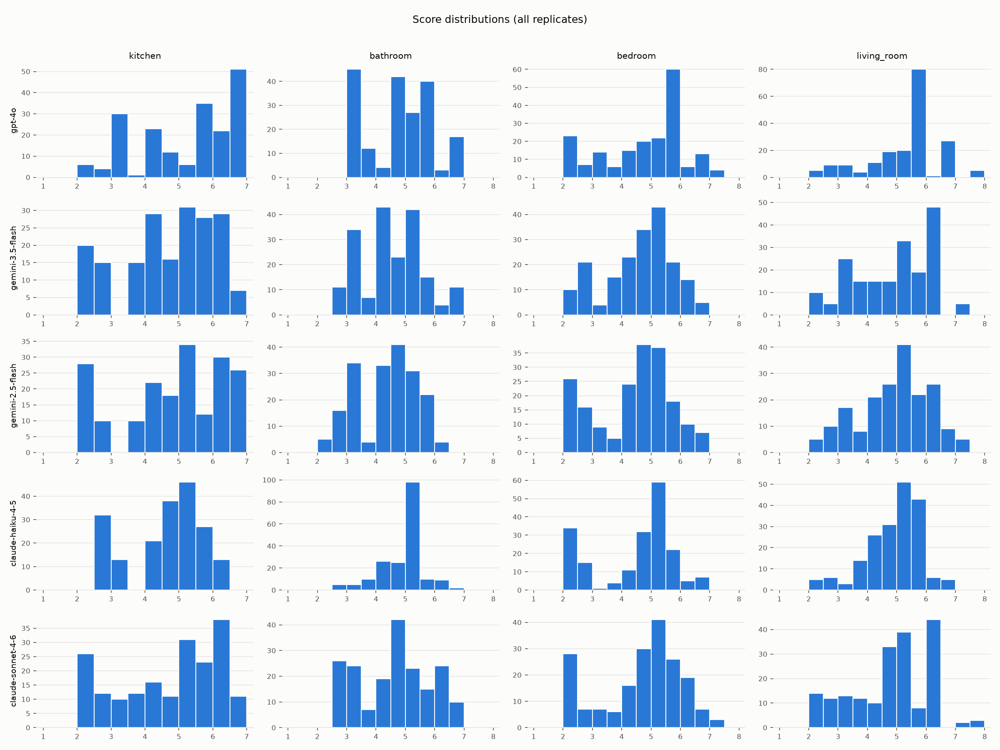
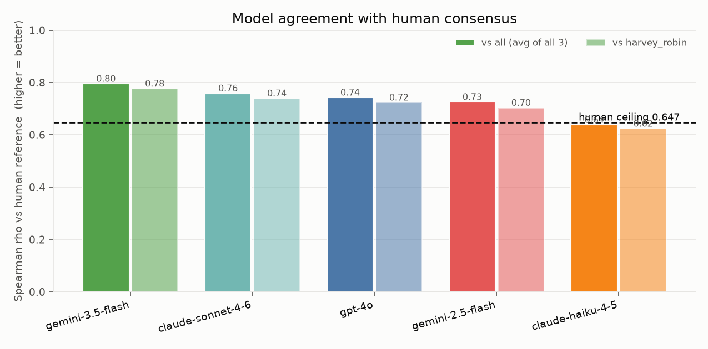
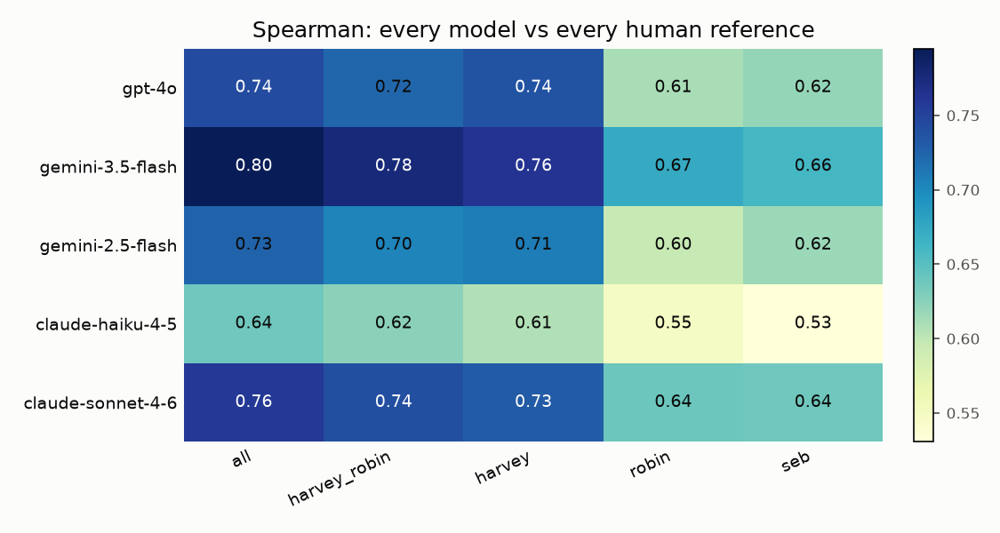
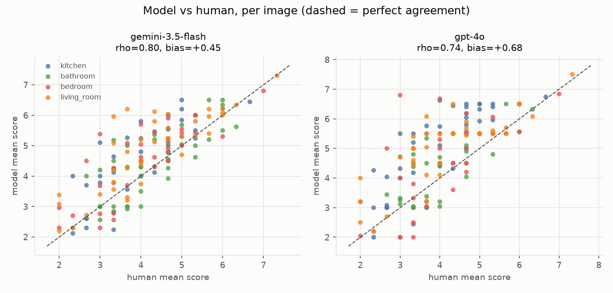
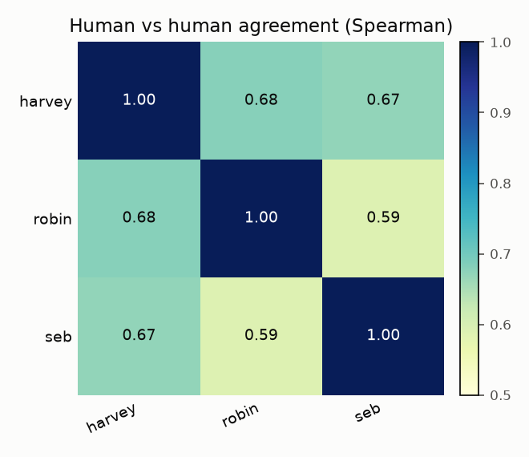
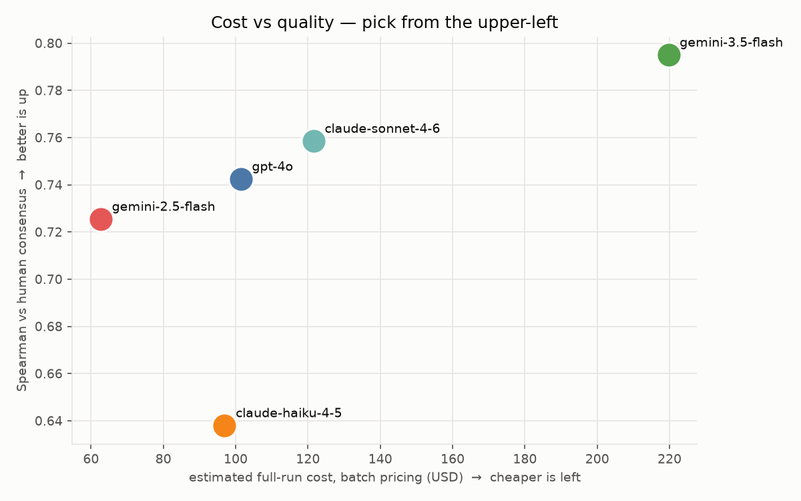

# Luxury-scoring model comparison — plain-language guide

A companion to [`report.md`](report.md). The report is the raw numbers; this
document explains what each number means, how to read every table, what this
particular run is telling us, and what to do about it. Where the report shows a
table, this guide tells you which direction is "good" and what the current
values imply.

---

## 1. What this experiment actually tested

The production pipeline scores each listing photo for how *luxurious* the room
looks, on a per-room scale (kitchens 1–7; bathrooms, bedrooms, living rooms
1–8). Today that scoring is done by **gpt-4o**. The question is: **is there a
better or cheaper model we should switch to?**

To answer that we took **152 real listing images** (~38 per room type, at most
one image per room type per property so no single home dominates), and for each
image we asked **five models** to score it **five times each**, using the exact
same rubric prompt and anchor-grid reference image the production `score.py`
uses. Five repeats per image is what lets us measure whether a model is
*consistent* (does it give the same answer when asked the same question?).

Separately, **three humans** (harvey, robin, seb) scored all 152 images by hand.
That gives us a human ground-truth to compare the models against — not just
"which model agrees with gpt-4o" but "which model agrees with people."

The five models:

| model | who makes it | role in this test |
|:------|:-------------|:------------------|
| gpt-4o | OpenAI | the incumbent — what we run today |
| gemini-2.5-flash | Google | cheap challenger |
| gemini-3.5-flash | Google | newer, pricier challenger |
| claude-haiku-4-5 | Anthropic | cheap challenger |
| claude-sonnet-4-6 | Anthropic | mid-tier challenger |

---

## 2. Consistency — "does the model repeat itself?"

**Report section:** *Consistency (within-image std vs between-image std)*

This is the single most important quality metric, and here's the intuition.
Every image was scored 5 times. Two kinds of variation exist:

- **within-image std** — how much a model's *own five scores* for the *same
  image* jump around. This is pure noise. You want it near zero: ask the same
  question, get the same answer.
- **between-image std** — how much the average scores differ *across different
  images*. This is real signal — luxurious rooms should score higher than plain
  ones, so this should be large.

The headline number is the **ratio = within ÷ between**. It answers: *is the
model's random noise small compared to the real differences it's supposed to be
detecting?*

- **ratio well below 1 = good.** Noise is tiny next to signal.
- **ratio near or above 1 = bad.** The model's own randomness is as big as the
  differences between properties, so its scores aren't trustworthy.

**What this run shows (mean ratio across room types):**

| model | mean ratio | read |
|:------|-----------:|:-----|
| gemini-3.5-flash | **0.041** | far and away the steadiest — its repeats barely move |
| claude-sonnet-4-6 | 0.076 | very stable |
| gpt-4o | 0.086 | the incumbent; solid |
| claude-haiku-4-5 | 0.093 | fine |
| gemini-2.5-flash | 0.096 | still fine, but the noisiest of the five |

All five are well under 1, so **every model is usable** — none is just guessing.
But gemini-3.5-flash is in a class of its own: roughly **2× steadier** than
gpt-4o and the rest. If you re-score the same photo tomorrow, it's the least
likely to give you a different number.

---

## 3. Score distributions — "does the model use the whole scale?"

**Report section:** *Score distributions* (histograms + compression flags)

A model can be consistent but still useless if it rates almost everything a 5.
These histograms show the spread of scores each model gives per room type.

The **`compressed` flag** is a warning light. It trips when a model either
barely touches the top/bottom of the scale, or uses less than 60% of the
available range. `compressed = True` means "this model bunches its scores in the
middle and rarely commits to *this is a dump* or *this is stunning*."

How to use it: don't treat `compressed = True` as disqualifying — it's normal
for real listing photos to cluster in the middle (most rooms are average). Use
it as a tie-breaker. A model with less compression is drawing sharper
distinctions between properties. In this run the flag trips for most
model/room combinations (bathrooms especially — real bathrooms don't vary
much), which is expected. Kitchens show the most spread across all models.

---

## 4. Agreement with gpt-4o — "how different is each challenger from today?"

**Report section:** *Spearman rank correlation of mean scores vs gpt-4o*

**Spearman correlation** measures whether two scorers *rank* the images the same
way — do they agree on which rooms are fancier than which? It ignores absolute
offsets (one scorer running 0.5 higher across the board doesn't hurt it); it
only cares about order. Runs from −1 (opposite) through 0 (unrelated) to
**1 (identical ranking)**.

This table is **vs gpt-4o**, so it answers "if we switched, how much would the
ordering change from what we ship today?" — *not* "which is more correct." gpt-4o
is the baseline, not the truth.

**What this run shows (overall):** gemini-3.5-flash 0.938, gemini-2.5-flash
0.926, claude-sonnet-4-6 0.921, claude-haiku-4-5 0.818. So the two Geminis and
Sonnet are all **very close to gpt-4o** (0.92–0.94) — switching to any of them
would mostly preserve today's ordering. claude-haiku-4-5 drifts the most (0.82):
it's the biggest behavior change from the incumbent.

**Disagreements vs gpt-4o (|mean diff| ≥ 2 levels): None.** No model ever landed
a full 2 scale-points away from gpt-4o on any image. There are no blow-up cases
to inspect — differences are gradual, not wild.

---

## 5. Room-type sanity check

**Report section:** *Room-type disagreement rate*

During scoring, each model also states what room it thinks it's looking at. This
table checks that against the Stage 1 label. **Every value is 0** — the models
never disagreed about what room a photo showed. This is purely a data-integrity
check (are we scoring kitchens with the kitchen rubric?), and it passed cleanly.
Nothing to act on.

---

## 6. Cost — "what does a full production run cost?"

**Report section:** *Cost*

`mean_cost_per_call_usd` is measured directly from the API responses (real token
counts, real prices, with prompt caching already applied). The `full_run_*`
columns extrapolate to scoring the **entire corpus** — an estimated **41,779
scoreable images** — once each. `batch` = using each provider's async batch API,
which is ~half price but slower (fine for a bulk backfill, not for live scoring).

**What a full run costs (batch price):**

| model | per call | full run (batch) | full run (standard) |
|:------|---------:|-----------------:|--------------------:|
| gemini-2.5-flash | $0.0030 | **$63** | $125 |
| claude-haiku-4-5 | $0.0046 | $97 | $194 |
| gpt-4o (today) | $0.0049 | $101 | $203 |
| claude-sonnet-4-6 | $0.0058 | $122 | $243 |
| gemini-3.5-flash | $0.0105 | $220 | $439 |

The spread is ~3.5× from cheapest to most expensive. gemini-3.5-flash — the
quality winner — is also **the most expensive**, about 2× the cost of running
gpt-4o today. gemini-2.5-flash is the cheapest by a wide margin. Latency (also in
the table) ranges ~4.5–9s per call and matters only if you score live rather
than in batch.

---

## 7. Agreement with humans — the most important section

**Report section:** *Human agreement (Stage 2b ratings)*

Sections 4–5 compared models to *gpt-4o*, which is circular — gpt-4o isn't
necessarily right. This section compares every model to **actual human
judgment**, which is the real target. Three people scored all 152 images, and we
compare each model against several **human references**:

- **`all`** — the average of all three raters (the consensus "house view").
- **`harvey_robin`** — the average of just harvey and robin.
- **`harvey`, `robin`, `seb`** — each person on their own.

Averaging raters cancels individual noise, so the group references (`all`,
`harvey_robin`) are the most stable targets; the individual columns show how each
person's personal taste lines up with the models.

There are **three tables**, each answering a different question:

The dashed line is the human ceiling (0.647). Bars above it track the group
consensus at least as well as an individual human would — see 7d for why that's
possible. The full picture, including each rater individually, is the heatmap
below (darker = stronger agreement):

### 7a. Spearman rho — do model and human *rank* rooms the same? (higher = better)

| model | vs `all` | vs harvey_robin | read |
|:------|---------:|----------------:|:-----|
| gemini-3.5-flash | **0.795** | **0.776** | best human agreement of any model |
| claude-sonnet-4-6 | 0.758 | 0.739 | second |
| gpt-4o (today) | 0.742 | 0.723 | the incumbent |
| gemini-2.5-flash | 0.725 | 0.703 | slightly below gpt-4o |
| claude-haiku-4-5 | 0.638 | 0.624 | clearly the weakest vs humans |

gemini-3.5-flash agrees with people best, and by a real margin over gpt-4o.
claude-haiku-4-5 is the one to avoid on quality grounds.

Seeing it per-image makes the correlation and the bias concrete — the winner
sits tighter to the diagonal, and both models sit mostly *above* it (scoring
higher than people):

### 7b. Mean absolute deviation — how many *points* off is the model, typically? (lower = better)

This is in actual score units. `0.67` means the model's average score for an
image is, on average, two-thirds of a point away from the humans'. Against
`all`, gemini-3.5-flash is closest (0.67) and gpt-4o is farthest (0.90). Note
every model is *further* from seb (≈1.0+) than from harvey — see 7d.

### 7c. Signed bias — does the model run *high* or *low* vs humans? (near 0 = neutral)

Positive means the model scores **higher** than the human. **Every model has a
positive bias against every rater** — the models are uniformly more generous
than the people, gpt-4o most of all (+0.68 vs `all`). This is easy to correct
(you can subtract a constant), and because it's a roughly uniform offset it
doesn't hurt the ranking metrics in 7a. Worth knowing if the absolute score
value is shown to users or fed into a threshold.

### 7d. Humans vs humans — the reality check (inter-rater matrix + ceiling)

Before judging the models, ask: *how well do the humans even agree with each
other?* The pairwise Spearman among raters: harvey–robin 0.68, harvey–seb 0.67,
robin–seb 0.59. The **human-agreement ceiling is 0.647** — the average
person-to-person agreement.

This ceiling is the yardstick. **No model should be expected to agree with the
average human more than humans agree with each other**, because the humans
themselves don't have a single "right" answer — luxury is subjective. And indeed
the top models (gemini-3.5-flash at 0.795, Sonnet at 0.758, gpt-4o at 0.742)
score *above* the 0.647 ceiling against the `all` reference. That's not magic —
it's because the `all` reference is an *average* of three people, and an average
is smoother and more predictable than any single noisy rater. It means these
models track the group consensus at least as well as an individual human would.

**On the raters:** none is flagged as an outlier (all agree with the others
about equally, 0.63–0.68). seb is very slightly the odd one out — every model is
harsher-looking against seb because **seb rates lower than harvey and robin**, so
the models' generous scores sit farther above his. That's a difference in seb's
personal scale, not a data problem. harvey and robin are the tightest-agreeing
pair, which is why `harvey_robin` is offered as a second consensus reference.

---

## 8. The recommendation

**Report section:** *Recommendation* → **Pick: gemini-3.5-flash**

How the pick is made: take the models that agree with the human consensus
(`all`) within 0.05 of the ceiling, then among those prefer the most consistent,
then the cheapest.

The whole trade-off on one chart — quality (up) against full-run cost (right).
The ideal model is upper-left; gemini-3.5-flash buys the top quality at the top
price, while claude-sonnet-4-6 sits on the efficient frontier between it and the
incumbent:

**gemini-3.5-flash wins on quality, cleanly:**

- **Best human agreement** — 0.795 vs the human consensus, ahead of gpt-4o
  (0.742) and everything else.
- **By far the most consistent** — 0.041 ratio, ~2× steadier than gpt-4o; its
  repeat scores barely move.
- **Closest to humans in absolute points** (lowest MAD) and one of the smaller
  biases.

**The catch is cost.** It's the most expensive model tested — ~$220 to score the
full corpus in batch vs ~$101 for gpt-4o today, roughly 2×.

### So which should you actually pick?

It depends on what you're optimizing:

- **Best quality, cost is acceptable → gemini-3.5-flash.** It genuinely beats
  gpt-4o on both agreeing-with-humans and stability. If scoring cost isn't a
  pain point (a few hundred dollars for a full backfill, less for incremental
  new listings), this is the upgrade.

- **Best quality-per-dollar → claude-sonnet-4-6.** It's the *second* best on
  human agreement (0.758, above gpt-4o) and very consistent (0.076), for only a
  small cost premium over the incumbent (~$122 vs ~$101 full-run batch). You get
  most of gemini-3.5-flash's quality gain at nearly half its cost.

- **Cheapest → gemini-2.5-flash.** By far the lowest cost (~$63 full run, ~40%
  cheaper than gpt-4o), but it's the *noisiest* model and lands slightly *below*
  gpt-4o on human agreement — you'd be trading a little quality for the savings.

- **Don't switch to claude-haiku-4-5** on quality — it's the weakest human
  agreement (0.638, below the incumbent) despite being cheap.

- **Staying on gpt-4o is defensible.** It's mid-pack on everything and there's no
  disagreement blow-up. The case to switch is that gemini-3.5-flash is
  *measurably* better with humans and much steadier — but it's not a correctness
  emergency.

**Bottom line:** if you'll pay for quality, **gemini-3.5-flash**. If you want the
best quality-per-dollar without losing ground to today, **claude-sonnet-4-6**.
The cheap option **gemini-2.5-flash** only makes sense if cost dominates and you
can tolerate its extra noise.

---

## 9. Caveats — how much to trust this

- **Sample size is 152 images, 3 raters.** The rankings are stable and the gaps
  between the top models and haiku are real, but small differences (e.g.
  gpt-4o vs gemini-2.5-flash) are within noise — don't over-read a 0.02 gap.
- **Luxury is subjective.** The 0.647 human ceiling proves even careful people
  disagree meaningfully. "Agrees with humans" means "agrees with *these three*
  humans' average," which is the best available proxy, not absolute truth.
- **The uniform positive bias** (models score higher than humans) is correctable
  with a constant offset and doesn't affect rankings, but matters if the raw
  score is user-facing or feeds a fixed threshold.
- **Costs are extrapolations** from measured per-call cost × an estimated 41,779
  scoreable images; the real bill scales with how many images you actually score
  and whether you use batch pricing.
- **All numbers regenerate** from `stage5_report.py`. If you collect more ratings
  or re-score, re-run it and this guide's specific figures may shift (the *way to
  read them* won't).

---

## Appendix — full data tables

Every table from the raw `report.md`, so this document is self-contained. These
are a snapshot; if you collect more ratings or re-score and re-run
`stage5_report.py`, refresh these from the regenerated `report.md`.

### A1. Exact model IDs used

| model             | response model id(s)      |
|:------------------|:--------------------------|
| claude-haiku-4-5  | claude-haiku-4-5-20251001 |
| claude-sonnet-4-6 | claude-sonnet-4-6         |
| gemini-2.5-flash  | gemini-2.5-flash          |
| gemini-3.5-flash  | gemini-3.5-flash          |
| gpt-4o            | gpt-4o-2024-08-06         |

### A2. Consistency, per model per room (within/between std)

| model             | room_type   |   n_images |   within_image_std |   between_image_std |   ratio_within_over_between |
|:------------------|:------------|-----------:|-------------------:|--------------------:|----------------------------:|
| claude-haiku-4-5  | bathroom    |         38 |              0.06  |               0.775 |                       0.078 |
| claude-haiku-4-5  | bedroom     |         38 |              0.107 |               1.368 |                       0.078 |
| claude-haiku-4-5  | kitchen     |         38 |              0.09  |               1.119 |                       0.08  |
| claude-haiku-4-5  | living_room |         38 |              0.126 |               0.938 |                       0.135 |
| claude-sonnet-4-6 | bathroom    |         38 |              0.108 |               1.234 |                       0.087 |
| claude-sonnet-4-6 | bedroom     |         38 |              0.105 |               1.367 |                       0.077 |
| claude-sonnet-4-6 | kitchen     |         38 |              0.092 |               1.465 |                       0.063 |
| claude-sonnet-4-6 | living_room |         38 |              0.103 |               1.333 |                       0.077 |
| gemini-2.5-flash  | bathroom    |         38 |              0.096 |               1.034 |                       0.093 |
| gemini-2.5-flash  | bedroom     |         38 |              0.166 |               1.291 |                       0.129 |
| gemini-2.5-flash  | kitchen     |         38 |              0.101 |               1.495 |                       0.067 |
| gemini-2.5-flash  | living_room |         38 |              0.113 |               1.209 |                       0.093 |
| gemini-3.5-flash  | bathroom    |         38 |              0.043 |               1.076 |                       0.04  |
| gemini-3.5-flash  | bedroom     |         38 |              0.058 |               1.133 |                       0.052 |
| gemini-3.5-flash  | kitchen     |         38 |              0.044 |               1.318 |                       0.033 |
| gemini-3.5-flash  | living_room |         38 |              0.049 |               1.286 |                       0.038 |
| gpt-4o            | bathroom    |         38 |              0.102 |               1.086 |                       0.094 |
| gpt-4o            | bedroom     |         38 |              0.079 |               1.416 |                       0.056 |
| gpt-4o            | kitchen     |         38 |              0.12  |               1.425 |                       0.084 |
| gpt-4o            | living_room |         38 |              0.129 |               1.179 |                       0.11  |

### A3. Scale-compression flags, per model per room

| model             | room_type   |   share_in_extremes |   range_used |   scale_span | compressed   |
|:------------------|:------------|--------------------:|-------------:|-------------:|:-------------|
| claude-haiku-4-5  | bathroom    |               0     |          4   |            7 | True         |
| claude-haiku-4-5  | bedroom     |               0.105 |          4.5 |            7 | False        |
| claude-haiku-4-5  | kitchen     |               0.068 |          3.7 |            6 | False        |
| claude-haiku-4-5  | living_room |               0.026 |          4.5 |            7 | True         |
| claude-sonnet-4-6 | bathroom    |               0     |          4.3 |            7 | True         |
| claude-sonnet-4-6 | bedroom     |               0.016 |          4.8 |            7 | True         |
| claude-sonnet-4-6 | kitchen     |               0.258 |          4.6 |            6 | False        |
| claude-sonnet-4-6 | living_room |               0.026 |          5.5 |            7 | True         |
| gemini-2.5-flash  | bathroom    |               0     |          3.8 |            7 | True         |
| gemini-2.5-flash  | bedroom     |               0     |          4.7 |            7 | True         |
| gemini-2.5-flash  | kitchen     |               0.311 |          4.8 |            6 | False        |
| gemini-2.5-flash  | living_room |               0.026 |          4.9 |            7 | True         |
| gemini-3.5-flash  | bathroom    |               0     |          4   |            7 | True         |
| gemini-3.5-flash  | bedroom     |               0     |          4.5 |            7 | True         |
| gemini-3.5-flash  | kitchen     |               0.2   |          4.5 |            6 | False        |
| gemini-3.5-flash  | living_room |               0.026 |          5.1 |            7 | True         |
| gpt-4o            | bathroom    |               0     |          3.5 |            7 | True         |
| gpt-4o            | bedroom     |               0.137 |          5   |            7 | False        |
| gpt-4o            | kitchen     |               0.411 |          4.8 |            6 | False        |
| gpt-4o            | living_room |               0.026 |          5.3 |            7 | True         |

### A4. Spearman vs gpt-4o, per room

| model             |   overall |   kitchen |   bathroom |   bedroom |   living_room |
|:------------------|----------:|----------:|-----------:|----------:|--------------:|
| claude-haiku-4-5  |     0.818 |     0.838 |      0.804 |     0.903 |         0.823 |
| claude-sonnet-4-6 |     0.921 |     0.956 |      0.94  |     0.932 |         0.879 |
| gemini-2.5-flash  |     0.926 |     0.946 |      0.929 |     0.884 |         0.861 |
| gemini-3.5-flash  |     0.938 |     0.968 |      0.964 |     0.922 |         0.91  |

Disagreements vs gpt-4o (|mean diff| ≥ 2 levels): **None.**

### A5. Room-type disagreement rate (all zero)

Every model, every room type: `disagreement_rate = 0`. The scoring-call
room judgment never contradicted the Stage 1 label.

### A6. Cost (full)

| model             |   mean_cost_per_call_usd |   mean_latency_s |   est_scoreable_images |   full_run_standard_usd |   full_run_batch_usd |
|:------------------|-------------------------:|-----------------:|-----------------------:|------------------------:|---------------------:|
| claude-haiku-4-5  |                   0.0046 |           4.506  |                  41779 |                 193.891 |              96.9453 |
| claude-sonnet-4-6 |                   0.0058 |           8.9176 |                  41779 |                 243.095 |             121.548  |
| gemini-2.5-flash  |                   0.003  |           8.204  |                  41779 |                 125.385 |              62.6925 |
| gemini-3.5-flash  |                   0.0105 |           7.319  |                  41779 |                 439.455 |             219.727  |
| gpt-4o            |                   0.0049 |           5.8076 |                  41779 |                 202.851 |             101.425  |

### A7. Human references

| reference    | kind       | raters             |   n_images |
|:-------------|:-----------|:-------------------|-----------:|
| all          | group      | harvey, robin, seb |        152 |
| harvey_robin | group      | harvey, robin      |        152 |
| harvey       | individual | harvey             |        152 |
| robin        | individual | robin              |        152 |
| seb          | individual | seb                |        152 |

### A8. Model vs human — Spearman rho (full matrix)

| model             |   all |   harvey_robin |   harvey |   robin |   seb |
|:------------------|------:|---------------:|---------:|--------:|------:|
| gpt-4o            | 0.742 |          0.723 |    0.736 |   0.611 | 0.62  |
| gemini-3.5-flash  | 0.795 |          0.776 |    0.763 |   0.673 | 0.66  |
| gemini-2.5-flash  | 0.725 |          0.703 |    0.708 |   0.596 | 0.616 |
| claude-haiku-4-5  | 0.638 |          0.624 |    0.606 |   0.547 | 0.531 |
| claude-sonnet-4-6 | 0.758 |          0.739 |    0.731 |   0.639 | 0.637 |

### A9. Model vs human — mean absolute deviation (full matrix)

| model             |   all |   harvey_robin |   harvey |   robin |   seb |
|:------------------|------:|---------------:|---------:|--------:|------:|
| gpt-4o            | 0.896 |          0.851 |    0.881 |   1.067 | 1.223 |
| gemini-3.5-flash  | 0.672 |          0.693 |    0.752 |   0.911 | 1.003 |
| gemini-2.5-flash  | 0.792 |          0.843 |    0.847 |   1.029 | 1.052 |
| claude-haiku-4-5  | 0.813 |          0.827 |    0.877 |   1.053 | 1.082 |
| claude-sonnet-4-6 | 0.786 |          0.783 |    0.827 |   0.976 | 1.092 |

### A10. Model vs human — signed bias, model minus human (full matrix)

| model             |   all |   harvey_robin |   harvey |   robin |   seb |
|:------------------|------:|---------------:|---------:|--------:|------:|
| gpt-4o            | 0.684 |          0.469 |    0.371 |   0.568 | 1.114 |
| gemini-3.5-flash  | 0.446 |          0.232 |    0.133 |   0.33  | 0.876 |
| gemini-2.5-flash  | 0.42  |          0.205 |    0.106 |   0.304 | 0.85  |
| claude-haiku-4-5  | 0.452 |          0.237 |    0.138 |   0.336 | 0.882 |
| claude-sonnet-4-6 | 0.484 |          0.269 |    0.17  |   0.368 | 0.914 |

### A11. Human vs human — inter-rater matrix and per-rater agreement

| | harvey | robin | seb |
|:-------|---------:|--------:|------:|
| harvey | 1     | 0.68  | 0.672 |
| robin  | 0.68  | 1     | 0.589 |
| seb    | 0.672 | 0.589 | 1     |

Human-agreement ceiling (mean pairwise rho): **0.647**.

| rater   |   n_rated |   mean_rho_vs_others | outlier   |
|:--------|----------:|---------------------:|:----------|
| harvey  |       152 |                0.676 | False     |
| robin   |       152 |                0.635 | False     |
| seb     |       152 |                0.63  | False     |

### A12. Recommendation candidates

| model             |   spearman_vs_human_mean |   consistency_ratio |   mean_cost_per_call_usd |
|:------------------|-------------------------:|--------------------:|-------------------------:|
| gemini-3.5-flash  |                   0.795  |              0.0407 |                   0.0105 |
| claude-sonnet-4-6 |                   0.7585 |              0.0761 |                   0.0058 |
| gpt-4o            |                   0.7424 |              0.0859 |                   0.0049 |
| claude-haiku-4-5  |                   0.638  |              0.0928 |                   0.0046 |
| gemini-2.5-flash  |                   0.7254 |              0.0955 |                   0.003  |

**Pick: gemini-3.5-flash.**

### A13. Per-room human ceiling (pairwise Spearman among harvey/robin/seb)

This is how much the humans agree *with each other* within each room — the
practical upper bound on what any model can hit. Bedroom and bathroom are the
noisiest (humans disagree most); kitchen and living room are the steadiest.

| room        |   ceiling | harvey–robin | harvey–seb | robin–seb |
|:------------|----------:|-------------:|-----------:|----------:|
| kitchen     |     0.719 |         0.81 |       0.63 |      0.72 |
| bathroom    |     0.626 |         0.68 |       0.66 |      0.54 |
| bedroom     |     0.598 |         0.57 |       0.71 |      0.51 |
| living_room |     0.707 |         0.74 |       0.70 |      0.68 |

### A14. Model vs human, **per room type** (the prompt-tuning view)

Everything in section 7 (rho / MAD / bias) but split by room, against two
references: `harvey+robin` (2 raters) and `all` (all 3). ~38 images per room.
Read this against the A13 ceilings: where rho already meets or beats the ceiling,
ranking is saturated and the only fixable error is **bias** (level offset).

**rho — do model and human rank the room the same? (higher = better)**

Reference: `harvey+robin`

| model             | kitchen | bathroom | bedroom | living_room |
|:------------------|--------:|---------:|--------:|------------:|
| gpt-4o            |   0.846 |    0.778 |   0.587 |       0.814 |
| gemini-3.5-flash  |   0.862 |    0.769 |   0.710 |       0.780 |
| gemini-2.5-flash  |   0.863 |    0.703 |   0.576 |       0.731 |
| claude-haiku-4-5  |   0.762 |    0.532 |   0.575 |       0.604 |
| claude-sonnet-4-6 |   0.887 |    0.746 |   0.623 |       0.694 |

Reference: `all (h+r+seb)`

| model             | kitchen | bathroom | bedroom | living_room |
|:------------------|--------:|---------:|--------:|------------:|
| gpt-4o            |   0.837 |    0.769 |   0.657 |       0.830 |
| gemini-3.5-flash  |   0.850 |    0.748 |   0.784 |       0.810 |
| gemini-2.5-flash  |   0.844 |    0.698 |   0.697 |       0.731 |
| claude-haiku-4-5  |   0.747 |    0.512 |   0.632 |       0.643 |
| claude-sonnet-4-6 |   0.867 |    0.733 |   0.685 |       0.727 |

**MAD — how many points off, typically? (lower = better)**

Reference: `harvey+robin`

| model             | kitchen | bathroom | bedroom | living_room |
|:------------------|--------:|---------:|--------:|------------:|
| gpt-4o            |   1.034 |    0.583 |   0.942 |       0.844 |
| gemini-3.5-flash  |   0.682 |    0.649 |   0.695 |       0.747 |
| gemini-2.5-flash  |   0.872 |    0.762 |   0.900 |       0.841 |
| claude-haiku-4-5  |   0.667 |    0.801 |   0.894 |       0.946 |
| claude-sonnet-4-6 |   0.751 |    0.687 |   0.893 |       0.799 |

Reference: `all (h+r+seb)`

| model             | kitchen | bathroom | bedroom | living_room |
|:------------------|--------:|---------:|--------:|------------:|
| gpt-4o            |   1.163 |    0.617 |   0.889 |       0.913 |
| gemini-3.5-flash  |   0.762 |    0.599 |   0.643 |       0.683 |
| gemini-2.5-flash  |   0.975 |    0.618 |   0.768 |       0.806 |
| claude-haiku-4-5  |   0.718 |    0.838 |   0.846 |       0.852 |
| claude-sonnet-4-6 |   0.884 |    0.665 |   0.870 |       0.724 |

**Signed bias — model minus human (positive = model scores high)**

Reference: `harvey+robin`

| model             | kitchen | bathroom | bedroom | living_room |
|:------------------|--------:|---------:|--------:|------------:|
| gpt-4o            |   0.901 |    0.029 |   0.324 |       0.623 |
| gemini-3.5-flash  |   0.459 |   -0.159 |   0.263 |       0.363 |
| gemini-2.5-flash  |   0.621 |   -0.308 |   0.107 |       0.399 |
| claude-haiku-4-5  |   0.340 |    0.265 |   0.049 |       0.294 |
| claude-sonnet-4-6 |   0.496 |   -0.045 |   0.343 |       0.282 |

Reference: `all (h+r+seb)`

| model             | kitchen | bathroom | bedroom | living_room |
|:------------------|--------:|---------:|--------:|------------:|
| gpt-4o            |   1.045 |    0.314 |   0.526 |       0.851 |
| gemini-3.5-flash  |   0.604 |    0.126 |   0.465 |       0.591 |
| gemini-2.5-flash  |   0.766 |   -0.023 |   0.309 |       0.628 |
| claude-haiku-4-5  |   0.485 |    0.550 |   0.251 |       0.522 |
| claude-sonnet-4-6 |   0.641 |    0.240 |   0.545 |       0.510 |

### A15. Mean score levels per room (why the bias is positive)

Every model's average sits **above** the human average in every room; the gap is
biggest in kitchen and living room. This is the calibration target — pull the
model's typical level down toward the human mean, especially in those two rooms.

| source            | kitchen | bathroom | bedroom | living_room |
|:------------------|--------:|---------:|--------:|------------:|
| **humans (all 3)**|    4.00 |     4.28 |    4.06 |        4.25 |
| gpt-4o            |    5.05 |     4.59 |    4.59 |        5.10 |
| gemini-3.5-flash  |    4.60 |     4.41 |    4.53 |        4.84 |
| gemini-2.5-flash  |    4.77 |     4.26 |    4.37 |        4.87 |
| claude-haiku-4-5  |    4.48 |     4.83 |    4.31 |        4.77 |
| claude-sonnet-4-6 |    4.64 |     4.52 |    4.61 |        4.76 |

**Takeaway for prompt tuning (all models show the same pattern → it's the
prompt/anchors, not the model):** ranking is already at or above the human
ceiling in every room, so there's no headroom left there. The remaining fixable
error is the upward level bias, concentrated in **kitchen** and **living room**.
Bathroom is the best-calibrated room (bias ≈ 0) — treat it as the template.
Bedroom has the lowest human ceiling (0.598), so its noise is largely
irreducible; don't over-invest there.

### A16. Share of images where gemini-3.5-flash is off by more than 1 point

Per-image gap between gemini's mean score (5 replicates) and the human mean.
38 images per room. "% >1" is the headline; the last columns count the larger
misses. Almost all of these are gemini scoring *high*.

Reference: `all (h+r+seb)`

| room        |   n | images >1 off |   % >1 | # >1.5 | # >2 |
|:------------|----:|--------------:|-------:|-------:|-----:|
| kitchen     |  38 |            13 | 34.2%  |      4 |    1 |
| living_room |  38 |            10 | 26.3%  |      4 |    2 |
| bedroom     |  38 |             7 | 18.4%  |      3 |    1 |
| bathroom    |  38 |             6 | 15.8%  |      1 |    0 |
| **all**     | 152 |            36 | 23.7%  |     12 |    4 |

Reference: `harvey+robin`

| room        |   n | images >1 off |   % >1 | # >1.5 | # >2 |
|:------------|----:|--------------:|-------:|-------:|-----:|
| kitchen     |  38 |             9 | 23.7%  |      2 |    1 |
| bedroom     |  38 |            11 | 28.9%  |      3 |    1 |
| living_room |  38 |            10 | 26.3%  |      4 |    2 |
| bathroom    |  38 |             6 | 15.8%  |      1 |    0 |
| **all**     | 152 |            36 | 23.7%  |     10 |    4 |

Same ranking as the bias/MAD tables: kitchen worst, bathroom best. "More than 1
point" is a loose bar relative to the human ceiling — most of these are 1–1.5
off, and only 4 of 152 exceed 2 points. A visual gallery of every >1 image
(photo + each rater's score + gemini's score) is generated separately by
`make_diff_gallery.py`.

---

*Self-contained companion to [`report.md`](report.md). To turn this into a PDF:*
`pandoc report_explained.md -o report_explained.pdf` *(or open it in any
Markdown viewer and print to PDF).*