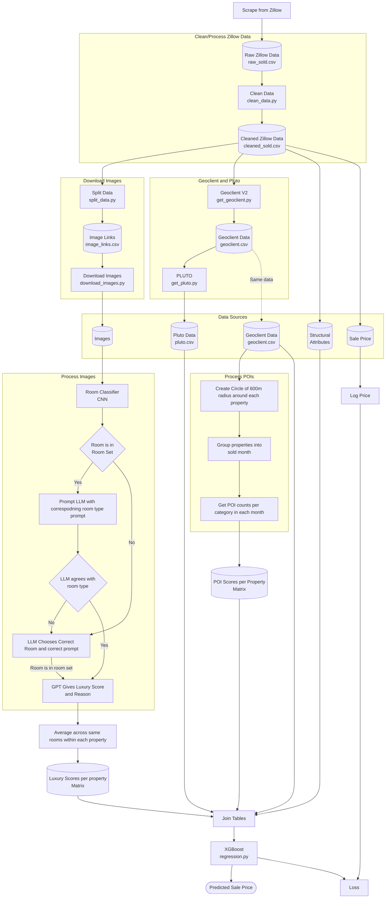

```mermaid
flowchart TD

    SCRAPE[Scrape from Zillow]

    subgraph CLEAN_ZILLOW[Clean/Process Zillow Data]
        ZRAW[(Raw Zillow Data <br/> raw_sold.csv)]
        ZRAW --> ZCLEAN[Clean Data <br/> clean_data.py]
        ZCLEAN --> ZCLEANED[(Cleaned Zillow Data <br/> cleaned_sold.csv)]
    end

    subgraph DOWNLOAD_IMAGES_GRAPH[Download Images]
        ZCLEANED --> SPLIT[Split Data <br/> split_data.py]
        SPLIT --> IMAGE_LINKS[(Image Links <br/> image_links.csv)]
        IMAGE_LINKS --> DOWNLOAD_IMAGES[Download Images <br/> download_images.py]
    end

    SCRAPE --> ZRAW
    DOWNLOAD_IMAGES --> IMAGES

    subgraph GEOCLIENT_PLUTO[Geoclient and Pluto]
        ZCLEANED --> GEOCLIENT[Geoclient V2 <br/> get_geoclient.py]
        GEOCLIENT --> GEOCLIENT_DATA_SRC[(Geoclient Data <br/> geoclient.csv)]
        GEOCLIENT_DATA_SRC -->  PLUTO[PLUTO <br/> get_pluto.py]
    end

    GEOCLIENT_DATA_SRC -.-> |Same data| GEOCLIENT_DATA
    PLUTO --> PLUTO_DATA

    subgraph DATA_SRC[Data Sources]
        STRUCT_ATTR[(Structural<br/>Attributes)]
        IMAGES[(Images)]
        PRICE[(Sale Price)]
        GEOCLIENT_DATA[(Geoclient Data <br/> geoclient.csv)]
        PLUTO_DATA[(Pluto Data <br/> pluto.csv)]
    end

    ZCLEANED --> STRUCT_ATTR
    ZCLEANED --> PRICE

    IMAGES --> ROOM_CNN

    subgraph IMAGES_PROC[Process Images]
        ROOM_CNN[Room Classifier <br/> CNN]
        ROOM_CNN --> IN_ROOM_SET{Room is in <br/> Room Set}
        IN_ROOM_SET --> |Yes| LLM_IMG_PROMPT[Prompt LLM with correspodning room type prompt]
        IN_ROOM_SET --> |No| LLM_CHOOSE_ROOM
        LLM_IMG_PROMPT --> LLM_AGREES{LLM agrees with <br/> room type}
        LLM_AGREES --> |No| LLM_CHOOSE_ROOM[LLM Chooses Correct Room and correct prompt]
        LLM_AGREES --> |Yes| LLM_SCORE[GPT Gives Luxury Score <br/> and Reason]
        LLM_CHOOSE_ROOM --> |Room is in room set| LLM_SCORE
    end

    LLM_SCORE --> AGGR_PHOTOS[Average across same rooms within each property]
    AGGR_PHOTOS --> IMG_MATRIX[(Luxury Scores per property<br/>Matrix)]

    subgraph POI_PROC[Process POIs]
        GEOCLIENT_DATA --> CREATE_CIRCLES[Create Circle of 600m radius around each property]
        CREATE_CIRCLES --> POI_DATE_AGGR[Group properties into <br/> sold month]
        POI_DATE_AGGR --> OHSOME[Get POI counts per category in each month]
    end

    OHSOME --> POI_MATRIX[(POI Scores per Property <br/> Matrix)]

    JOIN_TABLES[Join Tables]
    STRUCT_ATTR --> JOIN_TABLES
    IMG_MATRIX --> JOIN_TABLES
    POI_MATRIX --> JOIN_TABLES
    PLUTO_DATA --> JOIN_TABLES
    GEOCLIENT_DATA --> JOIN_TABLES

    JOIN_TABLES --> XGBOOST[XGBoost <br/> regression.py]
    XGBOOST --> PRICE_PRED([Predicted Sale Price])
    XGBOOST --> LOSS[Loss]
    PRICE --> LOG_PRICE[Log Price]
    LOG_PRICE --> LOSS
```